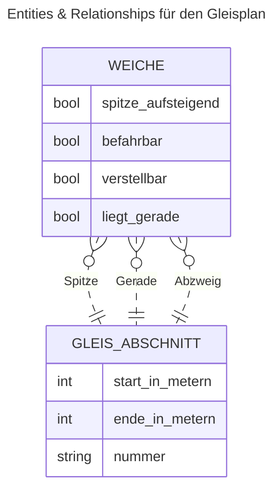

# raros
Rangier Roboter Systemanalyse und Konzeption, Abteilung Entity-Relationship Diagramme




```mermaid
---
title: Entities & Relationships für die Rangieraufgabe
---
erDiagram
    GLEIS {
        string nummer
    }
    WAGEN {
        string nummer        
    }
    WAGEN many(0)..1 GLEIS 
```