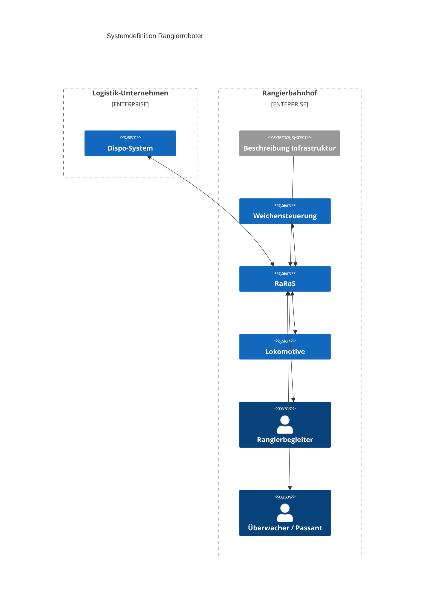
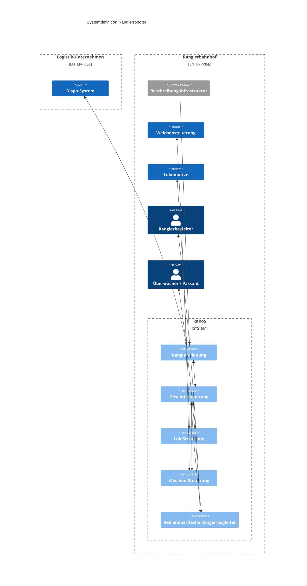

# raros
Rangier Roboter Systemanalyse und Konzeption, Abteilung Entity-Relationship Diagramme

```mermaid
    C4Context
      title Systemdefinition Rangierroboter
      Enterprise_Boundary(logisticsCompany, "Logistik-Unternehmen") {
        System(dispoSystem, "Dispo-System")
      }
      Enterprise_Boundary(theYard, "Rangierbahnhof") {
        System_Ext(infraStatic, "Beschreibung Infrastruktur")
        System(infraDynamic, "Weichensteuerung")
        System(raros, "RaRoS")
        System(locomotive, "Lokomotive")
        Person(personA, "Rangierbegleiter")
        Person(personB, "Überwacher / Passant")
      }

      Rel(infraStatic, raros, "")
      BiRel(raros, dispoSystem, "")
      BiRel(raros, locomotive, "")
      BiRel(raros, infraDynamic, "")
      BiRel(raros, personA, "")
      BiRel(raros, personB, "")
```

```mermaid
    C4Component
      title Systemdefinition Rangierroboter
      Enterprise_Boundary(logisticsCompany, "Logistik-Unternehmen") {
        System(dispoSystem, "Dispo-System")
      }
      Enterprise_Boundary(theYard, "Rangierbahnhof") {
        System_Ext(infraStatic, "Beschreibung Infrastruktur")
        System(infraDynamic, "Weichensteuerung")
        System_Boundary(raros, "RaRoS") {
          Component(planner, "Rangier-Planung")
          Component(executor, "Gesamt-Steuerung")
          Component(driver, "Lok-Steuerung")
          Component(switcher, "Weichen-Steuerung")
          Component(gui, "Bedienoberfläche Rangierbegleiter")
        }
        System(locomotive, "Lokomotive")
        Person(personA, "Rangierbegleiter")
        Person(personB, "Überwacher / Passant")
      }

        Rel(infraStatic, planner, "")
        BiRel(planner, dispoSystem, "")
        BiRel(planner, executor, "")
        BiRel(executor, driver, "")
        BiRel(executor, switcher, "")
        BiRel(executor, gui, "")
        BiRel(driver, locomotive, "")
        BiRel(switcher, infraDynamic, "")
        BiRel(gui, personA, "")
        BiRel(gui, personB, "")
```
